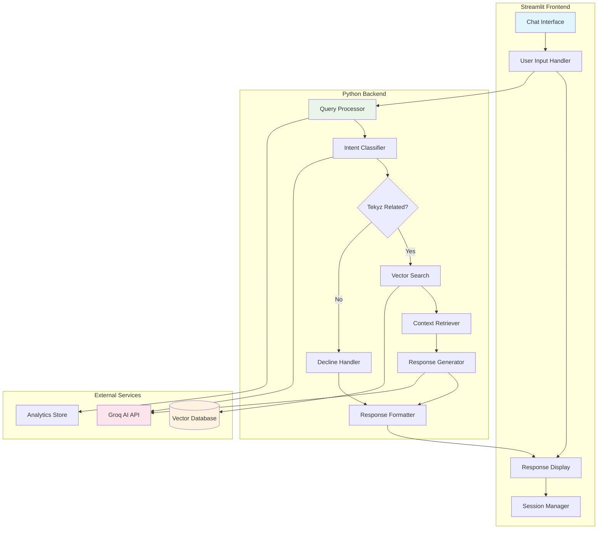

# Tekyz Chatbot with Streamlit - Detailed Task Document

## Overview

This document outlines all tasks required to implement the Tekyz Knowledge-Based Chatbot using Python backend with Streamlit frontend. The chatbot will use the populated vector database from the data ingestion phase to provide accurate, Tekyz-specific responses using Groq AI (Llama 3) with RAG (Retrieval Augmented Generation) pattern.

## Architecture Overview

### System Components

- **Frontend**: Streamlit web application
- **Backend**: Python with RAG pipeline
- **Vector Database**: Pre-populated Pinecone/Qdrant
- **LLM Service**: Groq AI (Llama 3)
- **Session Management**: Streamlit session state
- **Analytics**: Query logging and metrics

### Architecture Diagram



## Task Structure

Each task includes:

- **Task ID**: Unique identifier
- **Priority**: High/Medium/Low
- **Estimated Time**: Development hours
- **Dependencies**: Prerequisites
- **Subtasks**: Detailed breakdown
- **Acceptance Criteria**: Definition of done
- **Deliverables**: Expected outputs

---

## TASK 1: PROJECT SETUP & STREAMLIT FOUNDATION

**Task ID**: CB-001  
**Priority**: High  
**Estimated Time**: 4 hours  
**Dependencies**: Data Ingestion Completed

### Subtasks:

#### 1.1 Create Chatbot Project Structure

**What to do:**

- Set up new project directory for chatbot
- Organize code into logical modules
- Initialize version control

**Detailed Steps:**

```bash
mkdir -p tekyz-chatbot/chatbot-app
cd tekyz-chatbot/chatbot-app
mkdir -p {src,config,tests,logs,assets,pages,components}
mkdir -p src/{backend,frontend,utils,models}
```

**Project Structure:**

```
chatbot-app/
├── src/
│   ├── backend/
│   │   ├── __init__.py
│   │   ├── query_processor.py
│   │   ├── vector_search.py
│   │   ├── response_generator.py
│   │   └── analytics.py
│   ├── frontend/
│   │   ├── __init__.py
│   │   ├── chat_interface.py
│   │   ├── sidebar.py
│   │   └── components.py
│   ├── utils/
│   │   ├── __init__.py
│   │   ├── config_manager.py
│   │   ├── logger.py
│   │   └── validators.py
│   └── models/
│       ├── __init__.py
│       └── data_models.py
├── config/
│   ├── settings.py
│   ├── prompts.py
│   └── secrets.py.example
├── assets/
│   ├── logo.png
│   ├── styles.css
│   └── favicon.ico
├── tests/
│   ├── test_backend.py
│   ├── test_frontend.py
│   └── test_integration.py
├── pages/
│   ├── 1_🏠_Home.py
│   ├── 2_📊_Analytics.py
│   └── 3_⚙️_Settings.py
├── app.py              # Main Streamlit app
├── requirements.txt
├── .env.example
├── .streamlit/
│   └── config.toml
└── README.md
```

#### 1.2 Dependencies and Environment Setup

**What to do:**

- Install Streamlit and required libraries
- Set up Python environment
- Configure development tools

**Create `requirements.txt`:**

```txt
# Streamlit and Web Framework
streamlit==1.28.1
streamlit-chat==0.1.1
streamlit-authenticator==0.2.3

# Vector Database Clients
pinecone-client==2.2.4
qdrant-client==1.6.4

# AI/ML Libraries
sentence-transformers==2.2.2
groq==0.4.1

# Data Processing
pandas==2.0.3
numpy==1.24.3
pydantic==2.4.2

# Utilities
python-dotenv==1.0.0
loguru==0.7.2
streamlit-option-menu==0.3.6
plotly==5.17.0
uuid==1.30

# Development Tools
pytest==7.4.2
black==23.9.1
flake8==6.1.0
```

#### 1.3 Streamlit Configuration

**What to do:**

- Configure Streamlit appearance and behavior
- Set up custom styling
- Configure page layout

**Create `.streamlit/config.toml`:**

```toml
[global]
developmentMode = false

[server]
port = 8501
enableCORS = false
enableXsrfProtection = false

[browser]
gatherUsageStats = false

[theme]
primaryColor = "#FF6B6B"
backgroundColor = "#FFFFFF"
secondaryBackgroundColor = "#F0F2F6"
textColor = "#262730"
font = "sans serif"
```

#### 1.4 Basic Streamlit App Structure

**What to do:**

- Create main application entry point
- Set up basic page layout
- Configure navigation structure

**Create `app.py`:**

```python
import streamlit as st
from src.frontend.chat_interface import ChatInterface
from src.utils.config_manager import ConfigManager
from src.utils.logger import setup_logger

def main():
    # Page configuration
    st.set_page_config(
        page_title="Tekyz AI Assistant",
        page_icon="🤖",
        layout="wide",
        initial_sidebar_state="expanded"
    )

    # Initialize configuration
    config = ConfigManager()
    logger = setup_logger()

    # Initialize chat interface
    chat_interface = ChatInterface(config, logger)
    chat_interface.render()

if __name__ == "__main__":
    main()
```

### Acceptance Criteria:

- [ ] Project structure created with all directories
- [ ] Streamlit environment properly configured
- [ ] Basic app runs without errors
- [ ] Navigation structure is functional
- [ ] Development environment is ready

### Deliverables:

- Complete project structure
- Configured Streamlit application
- Development environment setup
- Basic navigation framework

---

## TASK 2: BACKEND CORE COMPONENTS DEVELOPMENT

**Task ID**: CB-002  
**Priority**: High  
**Estimated Time**: 14 hours  
**Dependencies**: CB-001

### Subtasks:

#### 2.1 Configuration Management System

**What to do:**

- Create centralized configuration management
- Handle environment variables securely
- Support multiple deployment environments

**Create `src/utils/config_manager.py`:**

**Implementation Requirements:**

```python
from pydantic import BaseSettings
from typing import Optional, Dict, Any

class ConfigManager(BaseSettings):
    def __init__(self):
        # Load environment variables
        # Set default values
        # Validate configuration

    def get_groq_config(self) -> Dict[str, Any]:
        # Return Groq AI configuration
        # Include API keys and model settings

    def get_vector_db_config(self) -> Dict[str, Any]:
        # Return vector database configuration
        # Support both Pinecone and Qdrant

    def get_app_config(self) -> Dict[str, Any]:
        # Return application settings
        # Include UI and behavior settings
```

**Configuration Schema:**

```python
APP_CONFIG = {
    'app_name': 'Tekyz AI Assistant',
    'version': '1.0.0',
    'max_query_length': 500,
    'max_response_length': 1000,
    'session_timeout': 3600,
    'rate_limit': {
        'queries_per_minute': 30,
        'queries_per_hour': 200
    }
}

GROQ_CONFIG = {
    'api_key': 'env:GROQ_API_KEY',
    'base_url': 'https://api.groq.com/openai/v1',
    'models': {
        'classifier': 'llama3-8b-8192',
        'generator': 'llama3-70b-8192'
    },
    'default_params': {
        'temperature': 0.3,
        'max_tokens': 500,
        'top_p': 0.9
    }
}

VECTOR_DB_CONFIG = {
    'provider': 'pinecone',  # or 'qdrant'
    'index_name': 'tekyz-knowledge',
    'top_k': 5,
    'similarity_threshold': 0.7
}
```

#### 2.2 Query Processing Engine

**What to do:**

- Implement query validation and preprocessing
- Add intent classification logic
- Handle query filtering and routing

**Create `src/backend/query_processor.py`:**

**Core Functionality:**

```python
class QueryProcessor:
    def __init__(self, config, logger):
        # Initialize with configuration
        # Set up Groq client
        # Configure embedding model

    def process_query(self, user_query: str) -> Dict[str, Any]:
        # Main query processing pipeline
        # Validate, classify, and route query

    def validate_query(self, query: str) -> bool:
        # Check query length and format
        # Filter inappropriate content
        # Validate input safety

    def classify_intent(self, query: str) -> Dict[str, Any]:
        # Use Groq to classify query intent
        # Determine if Tekyz-related
        # Return confidence score

    def preprocess_query(self, query: str) -> str:
        # Clean and normalize query text
        # Handle special characters
        # Prepare for embedding
```

**Intent Classification Implementation:**

```python
CLASSIFICATION_PROMPT = """
You are a query classifier for Tekyz company chatbot.

Analyze the user query and determine if it's related to Tekyz company:
- Tekyz services (web development, mobile apps, software solutions)
- Tekyz portfolio and projects
- Tekyz team and company information
- Tekyz contact and business details
- General questions about Tekyz

Respond with a JSON object:
{
    "is_tekyz_related": boolean,
    "confidence": float (0.0 to 1.0),
    "category": "string (services|portfolio|company|contact|general|off-topic)",
    "reasoning": "brief explanation"
}

User Query: {query}
"""
```

#### 2.3 Vector Search Integration

**What to do:**

- Connect to populated vector database
- Implement similarity search functionality
- Add metadata filtering and ranking

**Create `src/backend/vector_search.py`:**

**Search Implementation:**

```python
class VectorSearchEngine:
    def __init__(self, config, logger):
        # Initialize vector database client
        # Set up embedding model
        # Configure search parameters

    def search_similar_content(self, query: str, filters: Dict = None) -> List[Dict]:
        # Convert query to embedding
        # Perform similarity search
        # Filter and rank results

    def generate_query_embedding(self, query: str) -> List[float]:
        # Use same model as data ingestion
        # Generate query vector
        # Normalize if required

    def apply_metadata_filters(self, filters: Dict) -> Dict:
        # Apply page type filters
        # Filter by content category
        # Add date/freshness filters

    def rank_search_results(self, results: List[Dict]) -> List[Dict]:
        # Apply additional ranking logic
        # Consider metadata relevance
        # Boost recent content
```

**Search Configuration:**

```python
SEARCH_CONFIG = {
    'similarity_threshold': 0.7,
    'max_results': 5,
    'boost_factors': {
        'homepage': 1.2,
        'services': 1.1,
        'portfolio': 1.0,
        'about': 0.9
    },
    'metadata_filters': [
        'page_type',
        'content_category',
        'language'
    ]
}
```

#### 2.4 Response Generation Engine

**What to do:**

- Implement RAG (Retrieval Augmented Generation) logic
- Create response generation with Groq AI
- Add response validation and formatting

**Create `src/backend/response_generator.py`:**

**RAG Implementation:**

```python
class ResponseGenerator:
    def __init__(self, config, logger):
        # Initialize Groq client
        # Load response templates
        # Set up validation rules

    def generate_response(self, query: str, context: List[Dict]) -> Dict[str, Any]:
        # Combine query with retrieved context
        # Generate response using Groq
        # Validate and format response

    def build_context_prompt(self, query: str, context_chunks: List[Dict]) -> str:
        # Assemble context from search results
        # Format for optimal LLM processing
        # Include source attribution

    def validate_response(self, response: str, query: str) -> Dict[str, Any]:
        # Check response quality
        # Verify Tekyz relevance
        # Detect hallucinations

    def format_final_response(self, response: str, sources: List[Dict]) -> Dict[str, Any]:
        # Format response for display
        # Add source citations
        # Include confidence metrics
```

**Response Generation Prompt:**

```python
RESPONSE_GENERATION_PROMPT = """
You are Tekyz's helpful AI assistant. Answer questions using ONLY the provided context about Tekyz.

CONTEXT:
{context}

RULES:
1. Answer only based on the provided context
2. Be helpful, professional, and accurate
3. If the context doesn't contain the answer, say "I don't have that specific information about Tekyz in my knowledge base"
4. Keep responses concise but informative
5. Always maintain a friendly, professional tone
6. Include relevant details from the context
7. Don't make up information not in the context

USER QUESTION: {query}

RESPONSE:
"""
```

#### 2.5 Analytics and Logging System

**What to do:**

- Implement comprehensive query analytics
- Add performance monitoring
- Create usage tracking system

**Create `src/backend/analytics.py`:**

**Analytics Implementation:**

```python
class AnalyticsManager:
    def __init__(self, config, logger):
        # Initialize analytics storage
        # Set up metrics collection
        # Configure data retention

    def log_query_interaction(self, query_data: Dict[str, Any]):
        # Log user query details
        # Track response generation
        # Record performance metrics

    def track_search_performance(self, search_metrics: Dict[str, Any]):
        # Monitor search response times
        # Track result relevance
        # Measure success rates

    def generate_usage_statistics(self) -> Dict[str, Any]:
        # Calculate usage metrics
        # Analyze query patterns
        # Generate performance reports

    def monitor_system_health(self) -> Dict[str, Any]:
        # Check system performance
        # Monitor error rates
        # Track resource usage
```

**Analytics Data Schema:**

```python
QUERY_LOG_SCHEMA = {
    'timestamp': 'datetime',
    'session_id': 'string',
    'user_query': 'string',
    'query_length': 'integer',
    'classification_result': 'object',
    'search_results_count': 'integer',
    'response_generated': 'string',
    'response_time_ms': 'integer',
    'confidence_score': 'float',
    'user_feedback': 'string',
    'error_occurred': 'boolean',
    'error_message': 'string'
}
```

### Acceptance Criteria:

- [ ] Configuration management loads settings correctly
- [ ] Query processing validates and classifies queries accurately
- [ ] Vector search retrieves relevant content efficiently
- [ ] Response generation produces coherent, Tekyz-specific answers
- [ ] Analytics system logs all interactions properly
- [ ] All backend components integrate seamlessly

### Deliverables:

- Complete backend processing pipeline
- Working RAG implementation
- Analytics and monitoring system
- Comprehensive error handling
- Unit tests for all components

---

## TASK 3: STREAMLIT FRONTEND DEVELOPMENT

**Task ID**: CB-003  
**Priority**: High  
**Estimated Time**: 10 hours  
**Dependencies**: CB-002

### Subtasks:

#### 3.1 Main Chat Interface Design

**What to do:**

- Create intuitive chat interface
- Implement message display system
- Add typing indicators and status updates

**Create `src/frontend/chat_interface.py`:**

**Chat Interface Implementation:**

```python
import streamlit as st
from streamlit_chat import message
import time
from typing import List, Dict, Any

class ChatInterface:
    def __init__(self, config, logger):
        # Initialize interface components
        # Set up session state management
        # Configure styling

    def render(self):
        # Main interface rendering method
        # Handle user interactions
        # Display chat history

    def display_chat_history(self):
        # Show previous messages
        # Handle different message types
        # Apply custom styling

    def handle_user_input(self):
        # Process new user messages
        # Trigger backend processing
        # Update chat history

    def display_typing_indicator(self):
        # Show "typing..." animation
        # Indicate processing status
        # Provide user feedback
```

**Interface Layout:**

```python
def create_chat_layout():
    """
    Layout Structure:
    ┌─────────────────────────────────────┐
    │ Header: Tekyz AI Assistant          │
    ├─────────────────────────────────────┤
    │ Chat History Area                   │
    │ ┌─────────────────────────────────┐ │
    │ │ User: Hello                     │ │
    │ │ Bot: Hi! How can I help you?    │ │
    │ │ ...                             │ │
    │ └─────────────────────────────────┘ │
    ├─────────────────────────────────────┤
    │ Input Area                          │
    │ [Text Input] [Send Button]          │
    └─────────────────────────────────────┘
    """

    # Header section
    st.title("🤖 Tekyz AI Assistant")
    st.markdown("Ask me anything about Tekyz - our services, portfolio, team, and more!")

    # Chat container
    chat_container = st.container()

    # Input section
    input_container = st.container()

    return chat_container, input_container
```

#### 3.2 Message Components and Styling

**What to do:**

- Design message bubble components
- Create custom CSS for chat appearance
- Implement responsive design

**Create `src/frontend/components.py`:**

**Message Components:**

```python
class MessageComponents:
    @staticmethod
    def user_message(content: str, timestamp: str = None):
        # Render user message bubble
        # Apply user-specific styling
        # Include timestamp if provided

    @staticmethod
    def bot_message(content: str, sources: List[Dict] = None, confidence: float = None):
        # Render bot response bubble
        # Show source citations
        # Display confidence indicator

    @staticmethod
    def system_message(content: str, message_type: str = "info"):
        # Display system notifications
        # Handle different message types (info, warning, error)
        # Apply appropriate styling

    @staticmethod
    def source_citation(sources: List[Dict]):
        # Display source references
        # Create expandable source details
        # Link to original content
```

**Custom CSS Styling:**

```css
/* Create assets/styles.css */
.chat-container {
  height: 600px;
  overflow-y: auto;
  padding: 1rem;
  border: 1px solid #e0e0e0;
  border-radius: 10px;
  background-color: #fafafa;
}

.user-message {
  background: linear-gradient(135deg, #667eea 0%, #764ba2 100%);
  color: white;
  padding: 0.75rem 1rem;
  border-radius: 18px 18px 4px 18px;
  margin: 0.5rem 0 0.5rem auto;
  max-width: 70%;
  word-wrap: break-word;
}

.bot-message {
  background: white;
  color: #333;
  padding: 0.75rem 1rem;
  border-radius: 18px 18px 18px 4px;
  margin: 0.5rem auto 0.5rem 0;
  max-width: 70%;
  box-shadow: 0 2px 4px rgba(0, 0, 0, 0.1);
  border-left: 4px solid #ff6b6b;
}

.typing-indicator {
  display: flex;
  align-items: center;
  padding: 0.5rem 1rem;
  font-style: italic;
  color: #666;
}

.source-citation {
  font-size: 0.8rem;
  color: #666;
  margin-top: 0.5rem;
  padding: 0.25rem 0.5rem;
  background-color: #f0f0f0;
  border-radius: 4px;
  border-left: 3px solid #ff6b6b;
}

.confidence-indicator {
  display: inline-block;
  padding: 0.2rem 0.5rem;
  border-radius: 12px;
  font-size: 0.7rem;
  margin-left: 0.5rem;
}

.confidence-high {
  background-color: #d4edda;
  color: #155724;
}
.confidence-medium {
  background-color: #fff3cd;
  color: #856404;
}
.confidence-low {
  background-color: #f8d7da;
  color: #721c24;
}
```

#### 3.3 Session State Management

**What to do:**

- Implement chat history persistence
- Manage user sessions effectively
- Handle state updates and synchronization

**Session Management Implementation:**

```python
class SessionManager:
    def __init__(self):
        # Initialize session variables
        # Set up state management

    def initialize_session(self):
        # Set default session values
        # Initialize chat history
        # Configure user preferences

    def update_chat_history(self, user_message: str, bot_response: Dict[str, Any]):
        # Add new messages to history
        # Maintain message ordering
        # Handle history size limits

    def get_chat_history(self) -> List[Dict[str, Any]]:
        # Retrieve current chat history
        # Format for display
        # Apply any filtering

    def clear_session(self):
        # Reset chat history
        # Clear user preferences
        # Initialize fresh session
```

**Session State Schema:**

```python
SESSION_STATE_SCHEMA = {
    'chat_history': [],
    'user_id': 'generated_uuid',
    'session_start': 'timestamp',
    'last_activity': 'timestamp',
    'query_count': 0,
    'preferences': {
        'theme': 'light',
        'language': 'en',
        'show_sources': True,
        'show_confidence': True
    },
    'current_conversation_id': 'uuid'
}
```

#### 3.4 Interactive Features and Controls

**What to do:**

- Add quick action buttons
- Implement feedback collection
- Create settings and preferences panel

**Interactive Features:**

```python
class InteractiveFeatures:
    def render_quick_actions(self):
        # Predefined question buttons
        # Common query shortcuts
        # Category-based suggestions

    def render_feedback_panel(self):
        # Thumbs up/down buttons
        # Detailed feedback form
        # Rating system

    def render_settings_panel(self):
        # User preferences
        # Display options
        # Privacy settings
```

**Quick Action Buttons:**

```python
QUICK_ACTIONS = {
    'Services': [
        "What services does Tekyz offer?",
        "Tell me about web development services",
        "What mobile app solutions do you provide?"
    ],
    'Portfolio': [
        "Show me Tekyz recent projects",
        "What kind of clients does Tekyz work with?",
        "Can you show examples of your work?"
    ],
    'Company': [
        "Tell me about Tekyz company",
        "Who are the team members?",
        "How can I contact Tekyz?"
    ]
}
```

#### 3.5 Error Handling and User Feedback

**What to do:**

- Implement graceful error handling
- Create user-friendly error messages
- Add loading states and progress indicators

**Error Handling Implementation:**

```python
class ErrorHandler:
    def handle_api_error(self, error: Exception):
        # Handle Groq API errors
        # Display user-friendly messages
        # Provide retry options

    def handle_search_error(self, error: Exception):
        # Handle vector database errors
        # Graceful degradation
        # Fallback responses

    def handle_general_error(self, error: Exception):
        # Catch-all error handler
        # Log error details
        # Provide support contact
```

**User Feedback Messages:**

```python
ERROR_MESSAGES = {
    'api_timeout': "I'm experiencing some delays. Please try again in a moment.",
    'search_failed': "I'm having trouble finding relevant information. Please rephrase your question.",
    'rate_limit': "You've reached the query limit. Please wait a moment before trying again.",
    'invalid_query': "I didn't understand that question. Please ask about Tekyz services, portfolio, or company information.",
    'system_error': "Something went wrong on my end. Please try again or contact support if the issue persists."
}
```

### Acceptance Criteria:

- [ ] Chat interface displays messages correctly
- [ ] User input is handled smoothly
- [ ] Session state persists across interactions
- [ ] Interactive features work as expected
- [ ] Error handling provides good user experience
- [ ] Responsive design works on different screen sizes

### Deliverables:

- Complete Streamlit chat interface
- Custom styling and responsive design
- Session management system
- Interactive features and controls
- Comprehensive error handling

---

## TASK 4: INTEGRATION AND ADVANCED FEATURES

**Task ID**: CB-004  
**Priority**: High  
**Estimated Time**: 8 hours  
**Dependencies**: CB-002, CB-003

### Subtasks:

#### 4.1 Backend-Frontend Integration

**What to do:**

- Connect Streamlit frontend with backend processing
- Implement asynchronous processing for better UX
- Add progress indicators and status updates

**Integration Implementation:**

```python
class ChatbotIntegration:
    def __init__(self):
        # Initialize backend components
        # Set up frontend handlers
        # Configure communication layer

    def process_user_query(self, query: str) -> Dict[str, Any]:
        # Full query processing pipeline
        # Handle all steps from input to response
        # Return formatted result

    def handle_chat_interaction(self, user_input: str):
        # Main interaction handler
        # Update UI during processing
        # Manage error states
```

**Processing Pipeline:**

```python
async def process_query_pipeline(query: str) -> Dict[str, Any]:
    """
    Complete query processing pipeline:
    1. Validate and preprocess query
    2. Classify intent (Tekyz-related?)
    3. Search vector database if relevant
    4. Generate response using RAG
    5. Format and return result
    """

    # Step 1: Query validation
    with st.spinner("Validating your question..."):
        is_valid = query_processor.validate_query(query)
        if not is_valid:
            return create_error_response("Invalid query")

    # Step 2: Intent classification
    with st.spinner("Understanding your question..."):
        classification = query_processor.classify_intent(query)
        if not classification['is_tekyz_related']:
            return create_decline_response()

    # Step 3: Vector search
    with st.spinner("Searching for relevant information..."):
        search_results = vector_search.search_similar_content(query)
        if not search_results:
            return create_no_results_response()

    # Step 4: Response generation
    with st.spinner("Generating response..."):
        response = response_generator.generate_response(query, search_results)

    # Step 5: Format result
    return format_final_result(response, search_results)
```

#### 4.2 Advanced Query Features

**What to do:**

- Implement conversation context awareness
- Add follow-up question handling
- Create query suggestion system

**Conversation Context:**

```python
class ConversationManager:
    def __init__(self):
        # Initialize conversation tracking
        # Set up context window management

    def maintain_conversation_context(self, current_query: str, history: List[Dict]):
        # Analyze conversation flow
        # Identify follow-up questions
        # Maintain context relevance

    def generate_follow_up_suggestions(self, last_response: Dict) -> List[str]:
        # Create relevant follow-up questions
        # Based on response content
        # Encourage deeper exploration
```

**Query Suggestions:**

```python
FOLLOW_UP_SUGGESTIONS = {
    'services': [
        "What is the typical timeline for these services?",
        "How much do these services cost?",
        "Can you show me examples of similar projects?"
    ],
    'portfolio': [
        "Tell me more about this project",
        "What technologies were used?",
        "How long did this project take?"
    ],
    'company': [
        "How can I get in touch with the team?",
        "What is Tekyz's experience in my industry?",
        "Do you offer consultation calls?"
    ]
}
```

#### 4.3 Response Enhancement Features

**What to do:**

- Add source citation display
- Implement confidence scoring visualization
- Create response rating system

**Response Enhancement:**

```python
class ResponseEnhancer:
    def add_source_citations(self, response: str, sources: List[Dict]) -> str:
        # Format response with source references
        # Create clickable source links
        # Display source metadata

    def display_confidence_score(self, confidence: float):
        # Visual confidence indicator
        # Color-coded confidence levels
        # Explanation of confidence meaning

    def create_rating_interface(self, response_id: str):
        # Thumbs up/down buttons
        # Detailed feedback form
        # Rating collection system
```

#### 4.4 Performance Optimization

**What to do:**

- Implement response caching
- Optimize vector search performance
- Add request batching and optimization

**Performance Optimization:**

```python
class PerformanceOptimizer:
    def __init__(self):
        # Initialize caching system
        # Set up performance monitoring

    def cache_frequent_queries(self, query: str, response: Dict) -> bool:
        # Cache common questions and responses
        # Implement cache invalidation
        # Monitor cache hit rates

    def optimize_vector_search(self, query: str) -> Dict:
        # Optimize search parameters
        # Implement search result caching
        # Use query expansion techniques

    def monitor_response_times(self, operation: str, duration: float):
        # Track operation performance
        # Identify bottlenecks
        # Generate performance reports
```

#### 4.5 Analytics Dashboard Integration

**What to do:**

- Create real-time analytics display
- Add usage statistics visualization
- Implement admin monitoring features

**Analytics Dashboard:**

```python
class AnalyticsDashboard:
    def render_usage_statistics(self):
        # Display query volume over time
        # Show popular question categories
        # Track user engagement metrics

    def render_performance_metrics(self):
        # Response time charts
        # Success rate indicators
        # Error rate monitoring

    def render_content_effectiveness(self):
        # Most referenced content
        # Search result quality metrics
        # User satisfaction scores
```

### Acceptance Criteria:

- [ ] Backend and frontend integrate seamlessly
- [ ] Advanced query features enhance user experience
- [ ] Response enhancements provide valuable context
- [ ] Performance optimizations improve speed
- [ ] Analytics dashboard provides useful insights

### Deliverables:

- Fully integrated chatbot application
- Advanced conversation features
- Performance optimization implementation
- Analytics and monitoring dashboard

---

## TASK 5: TESTING AND QUALITY ASSURANCE

**Task ID**: CB-005  
**Priority**: High  
**Estimated Time**: 6 hours  
**Dependencies**: CB-004

### Subtasks:

#### 5.1 Unit Testing for Backend Components

**What to do:**

- Create comprehensive unit tests
- Test all backend functions and classes
- Achieve high test coverage

**Test Implementation:**

```python
# tests/test_backend.py
import pytest
from src.backend.query_processor import QueryProcessor
from src.backend.vector_search import VectorSearchEngine
from src.backend.response_generator import ResponseGenerator

class TestQueryProcessor:
    def test_query_validation(self):
        # Test valid and invalid queries
        # Test edge cases and boundaries

    def test_intent_classification(self):
        # Test Tekyz-related queries
        # Test off-topic queries
        # Test ambiguous queries

    def test_query_preprocessing(self):
        # Test text cleaning
        # Test normalization
        # Test special character handling

class TestVectorSearch:
    def test_similarity_search(self):
        # Test search functionality
        # Test result ranking
        # Test metadata filtering

    def test_embedding_generation(self):
        # Test query embedding
        # Test embedding consistency
        # Test error handling

class TestResponseGenerator:
    def test_response_generation(self):
        # Test RAG pipeline
        # Test response quality
        # Test context integration

    def test_response_validation(self):
        # Test response filtering
        # Test Tekyz relevance
        # Test hallucination detection
```

#### 5.2 Integration Testing

**What to do:**

- Test complete user journey flows
- Validate component interactions
- Test error propagation and handling

**Integration Test Scenarios:**

```python
class TestChatbotIntegration:
    def test_complete_query_flow(self):
        # Test full pipeline: input → processing → response
        # Validate data flow between components
        # Test timing and performance

    def test_error_handling_flow(self):
        # Test API failures
        # Test database connectivity issues
        # Test graceful degradation

    def test_session_management(self):
        # Test conversation continuity
        # Test session state persistence
        # Test concurrent user handling
```

#### 5.3 User Experience Testing

**What to do:**

- Test Streamlit interface usability
- Validate responsive design
- Test accessibility features

**UX Test Cases:**

```python
def test_chat_interface_usability():
    # Test message display
    # Test input handling
    # Test navigation flow

def test_responsive_design():
    # Test mobile compatibility
    # Test different screen sizes
    # Test touch interactions

def test_accessibility():
    # Test keyboard navigation
    # Test screen reader compatibility
    # Test color contrast
```

#### 5.4 Performance Testing

**What to do:**

- Test response time under load
- Validate concurrent user handling
- Test resource usage optimization

**Performance Benchmarks:**

```python
PERFORMANCE_TARGETS = {
    'query_processing_time': '<3 seconds',
    'vector_search_time': '<1 second',
    'response_generation_time': '<2 seconds',
    'total_response_time': '<5 seconds',
    'concurrent_users': '50+ users',
    'memory_usage': '<512MB',
    'cpu_usage': '<70%'
}
```

#### 5.5 Quality Assurance and Validation

**What to do:**

- Validate response accuracy and relevance
- Test edge cases and error scenarios
- Ensure consistent behavior

**QA Test Suite:**

```python
class QualityAssurance:
    def test_response_accuracy(self):
        # Test with known Tekyz questions
        # Validate factual accuracy
        # Test consistency across sessions

    def test_filtering_effectiveness(self):
        # Test off-topic query filtering
        # Validate Tekyz-specific responses
        # Test edge case handling

    def test_security_considerations(self):
        # Test input sanitization
        # Validate secure API usage
        # Test rate limiting
```

### Acceptance Criteria:

- [ ] All unit tests pass with >90% coverage
- [ ] Integration tests validate complete workflows
- [ ] Performance benchmarks are met
- [ ] UX testing confirms usability
- [ ] QA validation ensures response quality

### Deliverables:

- Comprehensive test suite
- Performance benchmark results
- Quality assurance report
- Bug fixes and optimizations

---

## TASK 6: DEPLOYMENT AND PRODUCTION SETUP

**Task ID**: CB-006  
**Priority**: Medium  
**Estimated Time**: 4 hours  
**Dependencies**: CB-005

### Subtasks:

#### 6.1 Production Environment Configuration

**What to do:**

- Configure production settings
- Set up environment variables
- Optimize for production deployment

**Production Configuration:**

```python
# config/production.py
PRODUCTION_CONFIG = {
    'debug': False,
    'logging_level': 'INFO',
    'enable_analytics': True,
    'cache_enabled': True,
    'rate_limiting': True,
    'security_headers': True,
    'cors_enabled': False
}
```

#### 6.2 Deployment Scripts and Documentation

**What to do:**

- Create deployment automation
- Write deployment documentation
- Set up monitoring and health checks

**Deployment Assets:**

```bash
deployment/
├── docker/
│   ├── Dockerfile
│   ├── docker-compose.yml
│   └── requirements.txt
├── scripts/
│   ├── deploy.sh
│   ├── health_check.sh
│   └── backup.sh
└── docs/
    ├── deployment_guide.md
    ├── troubleshooting.md
    └── monitoring.md
```

#### 6.3 Monitoring and Alerting Setup

**What to do:**

- Implement application monitoring
- Set up error tracking
- Configure performance alerts

#### 6.4 Documentation and Handover

**What to do:**

- Create user documentation
- Write technical documentation
- Prepare handover materials

### Acceptance Criteria:

- [ ] Production environment is properly configured
- [ ] Deployment process is automated and documented
- [ ] Monitoring and alerting are functional
- [ ] Documentation is complete and accurate

### Deliverables:

- Production-ready application
- Deployment automation and documentation
- Monitoring and alerting setup
- Complete technical documentation

---

## Summary

### Total Estimated Time: 46 hours

### Critical Path: CB-001 → CB-002 → CB-003 → CB-004 → CB-005 → CB-006

### Key Technologies:

- **Frontend**: Streamlit with custom CSS
- **Backend**: Python with RAG implementation
- **AI/ML**: Groq AI (Llama 3) + Sentence Transformers
- **Database**: Pre-populated Vector Database (Pinecone/Qdrant)
- **Analytics**: Built-in logging and metrics

### Success Metrics:

- **Response Accuracy**: >90% for Tekyz-related queries
- **Response Time**: <5 seconds average
- **User Satisfaction**: >4.0/5.0 rating
- **System Uptime**: >99% availability
- **Query Filtering**: >95% accurate classification

### Project Structure Overview:

```
chatbot-app/
├── src/
│   ├── backend/           # Core processing logic
│   ├── frontend/          # Streamlit interface
│   ├── utils/            # Configuration and utilities
│   └── models/           # Data models and schemas
├── config/               # Environment configurations
├── assets/               # Static assets and styling
├── tests/                # Comprehensive test suite
├── deployment/           # Production deployment
└── app.py               # Main Streamlit application
```

This comprehensive task document provides a complete roadmap for building a production-ready Tekyz chatbot using Streamlit and Python, with clear deliverables and success criteria for each component.
