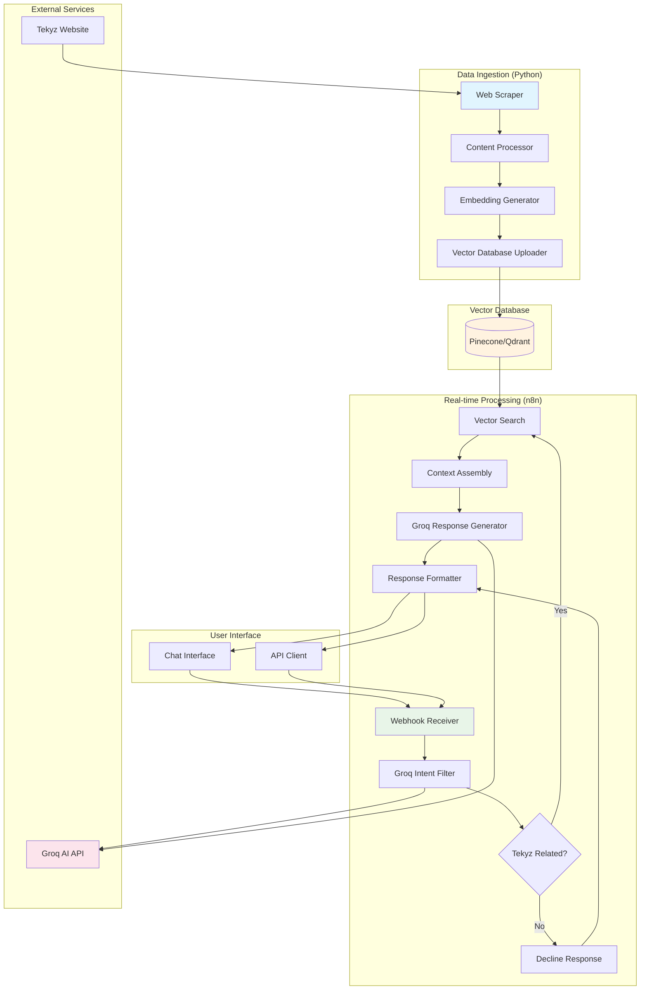
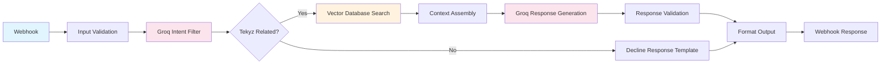
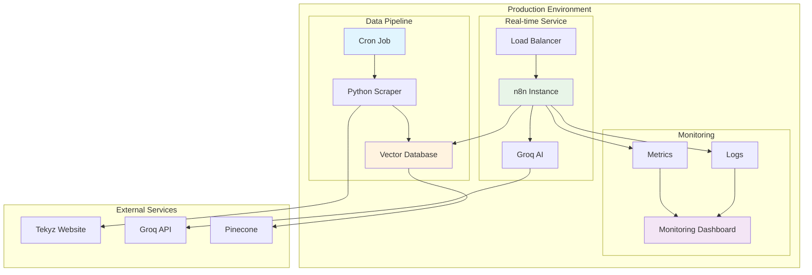

# Tekyz Knowledge-Based Chatbot - Technical Documentation

## Executive Summary

This document outlines the technical implementation plan for developing a knowledge-based chatbot for Tekyz that answers company-specific queries using content from tekyz.com. The solution uses Python for data ingestion and n8n for real-time query processing with Groq AI (Llama 3) as the language model.

## Architecture Overview

### System Components

- **Data Ingestion Layer**: Python script for web scraping and content processing
- **Vector Database**: Pinecone/Qdrant for storing embeddings
- **Query Processing Layer**: n8n workflow for real-time chatbot interactions
- **AI/ML Services**: Groq AI for intent classification and response generation
- **User Interface**: Webhook-based chat interface

### High-Level Architecture Diagram



## Detailed Technical Specifications

### 1. Data Ingestion Layer (Python)

#### 1.1 Web Scraping Component

**File**: `scrape_tekyz.py`

**Dependencies**:

```python
requests==2.31.0
beautifulsoup4==4.12.2
selenium==4.15.0  # For dynamic content if needed
lxml==4.9.3
```

**Key Functions**:

- `scrape_page(url)` - Extract content from single page
- `get_all_pages()` - Discover and crawl site structure
- `extract_main_content(html)` - Remove navigation/footer elements
- `handle_dynamic_content(url)` - Use Selenium for JS-heavy pages

**Target Pages**:

```python
TEKYZ_URLS = {
    'homepage': 'https://tekyz.com/',
    'services': 'https://tekyz.com/services',
    'portfolio': 'https://tekyz.com/portfolio',
    'about': 'https://tekyz.com/about',
    'team': 'https://tekyz.com/team',
    'contact': 'https://tekyz.com/contact',
    'blog': 'https://tekyz.com/blog'  # If exists
}
```

#### 1.2 Content Processing Component

**File**: `content_processor.py`

**Dependencies**:

```python
nltk==3.8.1
spacy==3.7.2
re
unicodedata
```

**Processing Pipeline**:

1. **HTML Cleaning**: Remove tags, scripts, styles
2. **Text Normalization**: Unicode handling, whitespace cleanup
3. **Content Chunking**: Split into 500-1000 character chunks
4. **Metadata Extraction**: Extract titles, headings, page context
5. **Deduplication**: Remove duplicate content across pages

**Chunking Strategy**:

```python
CHUNK_CONFIG = {
    'max_chunk_size': 800,
    'overlap_size': 100,
    'split_by': ['paragraph', 'sentence'],
    'preserve_context': True
}
```

#### 1.3 Embedding Generation Component

**File**: `embedding_generator.py`

**Dependencies**:

```python
sentence-transformers==2.2.2
torch==2.0.1
transformers==4.35.0
```

**Model Configuration**:

```python
EMBEDDING_CONFIG = {
    'model_name': 'all-MiniLM-L6-v2',
    'dimension': 384,
    'batch_size': 32,
    'max_sequence_length': 512
}
```

**Functions**:

- `load_model()` - Initialize embedding model
- `generate_embeddings(text_chunks)` - Convert text to vectors
- `batch_process(chunks)` - Handle large datasets efficiently

#### 1.4 Vector Database Integration

**File**: `vector_db_manager.py`

**Dependencies**:

```python
pinecone-client==2.2.4
# OR
qdrant-client==1.6.4
```

**Database Schema**:

```python
VECTOR_METADATA = {
    'id': 'unique_chunk_id',
    'text': 'original_text_content',
    'url': 'source_page_url',
    'page_type': 'homepage|services|portfolio|about',
    'heading': 'section_heading',
    'timestamp': 'ingestion_timestamp',
    'chunk_index': 'position_in_page'
}
```

### 2. Vector Database Configuration

#### 2.1 Pinecone Setup

```python
PINECONE_CONFIG = {
    'api_key': 'your-pinecone-api-key',
    'environment': 'us-west1-gcp-free',
    'index_name': 'tekyz-knowledge',
    'dimension': 384,
    'metric': 'cosine',
    'pods': 1
}
```

#### 2.2 Qdrant Setup (Alternative)

```python
QDRANT_CONFIG = {
    'host': 'localhost',
    'port': 6333,
    'collection_name': 'tekyz_knowledge',
    'vector_size': 384,
    'distance': 'Cosine'
}
```

### 3. Real-time Processing Layer (n8n)

#### 3.1 n8n Workflow: "Tekyz Chatbot"

**Workflow Diagram**:



#### 3.2 Node Configurations

**Webhook Node**:

```json
{
  "httpMethod": "POST",
  "path": "tekyz-chat",
  "responseMode": "responseNode",
  "options": {
    "noResponseBody": false
  }
}
```

**Groq Intent Filter Node**:

```json
{
  "url": "https://api.groq.com/openai/v1/chat/completions",
  "authentication": "headerAuth",
  "sendHeaders": true,
  "headerParameters": {
    "parameters": [
      {
        "name": "Authorization",
        "value": "Bearer {{$credentials.groqApi.apiKey}}"
      }
    ]
  },
  "sendBody": true,
  "bodyParameters": {
    "model": "llama3-8b-8192",
    "messages": [
      {
        "role": "system",
        "content": "You are a classifier. Respond only 'YES' if the query is about Tekyz company, their services, portfolio, team, or business. Respond 'NO' for any other topic."
      },
      {
        "role": "user",
        "content": "{{$json.query}}"
      }
    ],
    "max_tokens": 10,
    "temperature": 0.1
  }
}
```

**Vector Database Search Node**:

```json
{
  "url": "https://api.pinecone.io/query",
  "authentication": "headerAuth",
  "sendHeaders": true,
  "headerParameters": {
    "parameters": [
      {
        "name": "Api-Key",
        "value": "{{$credentials.pinecone.apiKey}}"
      }
    ]
  },
  "sendBody": true,
  "bodyParameters": {
    "vector": "{{$json.query_embedding}}",
    "topK": 5,
    "includeMetadata": true,
    "includeValues": false
  }
}
```

#### 3.3 Response Templates

**Decline Response Template**:

```json
{
  "response": "I can only help with questions about Tekyz - our services, portfolio, team, and company information. Please ask me something about Tekyz!",
  "type": "decline",
  "confidence": 1.0
}
```

**Error Response Template**:

```json
{
  "response": "I'm experiencing technical difficulties. Please try again in a moment or contact our support team.",
  "type": "error",
  "confidence": 0.0
}
```

### 4. API Integrations

#### 4.1 Groq AI Configuration

```python
GROQ_CONFIG = {
    'api_key': 'your-groq-api-key',
    'base_url': 'https://api.groq.com/openai/v1',
    'models': {
        'filter': 'llama3-8b-8192',
        'response': 'llama3-70b-8192'
    },
    'parameters': {
        'temperature': 0.3,
        'max_tokens': 500,
        'top_p': 0.9
    }
}
```

#### 4.2 System Prompts

**Intent Classification Prompt**:

```
You are a query classifier for Tekyz company chatbot.
Analyze if the user query is related to:
- Tekyz services
- Tekyz portfolio/projects
- Tekyz team/company info
- Tekyz contact/business

Respond ONLY with 'YES' or 'NO'.
```

**Response Generation Prompt**:

```
You are Tekyz company's helpful assistant. Use ONLY the provided context to answer questions about Tekyz.

Context: {retrieved_context}

Rules:
1. Answer only based on the provided context
2. Be helpful and professional
3. If context doesn't contain the answer, say "I don't have that specific information about Tekyz"
4. Keep responses concise but informative

User Question: {user_query}
```

## Implementation Plan

### Phase 1: Environment Setup (Week 1)

1. **Development Environment**

   - Set up Python virtual environment
   - Install required dependencies
   - Configure environment variables
   - Set up n8n instance

2. **External Service Setup**

   - Create Groq AI account and API keys
   - Set up Pinecone/Qdrant vector database
   - Configure authentication

3. **Project Structure Creation**
   ```
   tekyz-chatbot/
   ├── data-ingestion/
   │   ├── src/
   │   │   ├── scraper.py
   │   │   ├── processor.py
   │   │   ├── embeddings.py
   │   │   └── vector_db.py
   │   ├── config/
   │   │   ├── settings.py
   │   │   └── urls.py
   │   ├── requirements.txt
   │   ├── main.py
   │   └── .env
   ├── n8n-workflows/
   │   └── tekyz-chatbot.json
   ├── tests/
   │   ├── test_scraper.py
   │   ├── test_processor.py
   │   └── test_chatbot.py
   ├── docs/
   │   ├── api.md
   │   └── deployment.md
   └── README.md
   ```

### Phase 2: Data Ingestion Development (Week 2)

1. **Web Scraping Implementation**

   - Develop robust scraping for tekyz.com
   - Handle different page layouts
   - Implement error handling and retries
   - Add logging and monitoring

2. **Content Processing Pipeline**

   - Clean and normalize scraped content
   - Implement intelligent chunking
   - Extract metadata and context
   - Test with sample data

3. **Vector Database Integration**
   - Set up embedding generation
   - Implement database upload functionality
   - Create update/upsert mechanisms
   - Test with processed content

### Phase 3: n8n Workflow Development (Week 3)

1. **Basic Workflow Creation**

   - Build core chatbot workflow in n8n
   - Configure webhook endpoints
   - Set up Groq AI integrations
   - Implement basic query filtering

2. **Advanced Logic Implementation**

   - Add context retrieval from vector DB
   - Implement response generation
   - Add error handling and fallbacks
   - Create response formatting

3. **Integration Testing**
   - Connect Python data output to n8n
   - Test end-to-end functionality
   - Validate response quality
   - Performance testing

### Phase 4: Testing & Optimization (Week 4)

1. **Comprehensive Testing**

   - Unit tests for Python components
   - Integration tests for n8n workflow
   - End-to-end user journey testing
   - Performance and load testing

2. **Quality Assurance**

   - Test query filtering accuracy
   - Validate Tekyz-specific responses
   - Check response quality and relevance
   - Test edge cases and error scenarios

3. **Optimization**
   - Fine-tune filtering thresholds
   - Optimize vector search parameters
   - Improve response templates
   - Performance optimizations

### Phase 5: Deployment & Documentation (Week 5)

1. **Production Deployment**

   - Deploy Python scripts with scheduling
   - Deploy n8n workflows to production
   - Configure monitoring and alerting
   - Set up backup and recovery

2. **Documentation & Training**
   - Complete technical documentation
   - Create user guides
   - Document operational procedures
   - Prepare handover materials

## Configuration Files

### Python Configuration (`config/settings.py`)

```python
import os
from dotenv import load_dotenv

load_dotenv()

# Scraping Configuration
SCRAPING_CONFIG = {
    'delay_between_requests': 1.0,
    'timeout': 30,
    'retries': 3,
    'user_agent': 'TekyzBot/1.0'
}

# Processing Configuration
PROCESSING_CONFIG = {
    'chunk_size': 800,
    'chunk_overlap': 100,
    'min_chunk_length': 100,
    'remove_duplicates': True
}

# Vector Database Configuration
VECTOR_DB_CONFIG = {
    'provider': 'pinecone',  # or 'qdrant'
    'index_name': 'tekyz-knowledge',
    'dimension': 384,
    'metric': 'cosine'
}

# API Keys
GROQ_API_KEY = os.getenv('GROQ_API_KEY')
PINECONE_API_KEY = os.getenv('PINECONE_API_KEY')
PINECONE_ENVIRONMENT = os.getenv('PINECONE_ENVIRONMENT')
```

### n8n Environment Variables

```bash
# Groq AI
GROQ_API_KEY=your-groq-api-key

# Vector Database
PINECONE_API_KEY=your-pinecone-key
PINECONE_ENVIRONMENT=us-west1-gcp-free

# n8n Configuration
N8N_WEBHOOK_URL=https://your-n8n-instance.com/webhook/tekyz-chat
```

## Monitoring & Analytics

### Key Metrics to Track

1. **Data Quality Metrics**

   - Content freshness (last update timestamp)
   - Embedding quality scores
   - Duplicate content percentage

2. **Chatbot Performance Metrics**

   - Query classification accuracy
   - Response relevance scores
   - Response time (< 5 seconds target)
   - Error rate (< 5% target)

3. **Usage Analytics**
   - Total queries per day/week
   - Query categories and patterns
   - User satisfaction (if feedback implemented)
   - Peak usage times

### Logging Strategy

```python
LOGGING_CONFIG = {
    'level': 'INFO',
    'format': '%(asctime)s - %(name)s - %(levelname)s - %(message)s',
    'handlers': {
        'file': 'logs/tekyz-chatbot.log',
        'console': True
    },
    'log_queries': True,
    'log_responses': True,
    'log_errors': True
}
```

## Security Considerations

### Data Protection

- API keys stored as environment variables
- No sensitive Tekyz data in logs
- Secure vector database access
- Input validation and sanitization

### Rate Limiting

- Implement rate limiting on webhook endpoint
- Groq API usage monitoring
- Vector database query limits

### Error Handling

- Graceful degradation on service failures
- Fallback responses for system errors
- Comprehensive logging for debugging

## Deployment Architecture



## Success Criteria

### MVP Success Metrics

- **Accuracy**: 85%+ correct responses to Tekyz queries
- **Filtering**: 90%+ correct classification of Tekyz vs non-Tekyz queries
- **Performance**: <5 second average response time
- **Availability**: 95%+ uptime
- **Data Freshness**: Content updated within 7 days of website changes

### Post-MVP Expansion Goals

- Multi-language support
- Advanced analytics dashboard
- Integration with CRM/support systems
- Automated content updates
- Support for multiple knowledge bases

## Risk Mitigation

### Technical Risks

- **Groq API Limits**: Implement fallback responses
- **Vector DB Downtime**: Cache common responses
- **Website Structure Changes**: Robust scraping with error handling
- **n8n Instance Failure**: Multi-instance deployment

### Business Risks

- **Inaccurate Responses**: Comprehensive testing and validation
- **Off-topic Responses**: Strong filtering mechanisms
- **Performance Issues**: Load testing and optimization
- **Security Vulnerabilities**: Regular security audits

This technical documentation provides a comprehensive foundation for implementing the Tekyz knowledge-based chatbot MVP with clear implementation guidelines, technical specifications, and success criteria.
